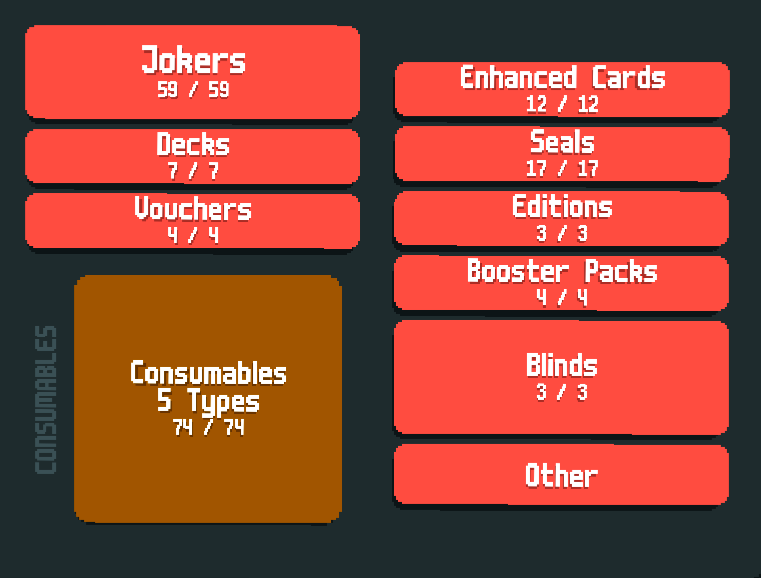

<h1>GIGA</h1>

What about adding some random things to <strong>Balatro</strong> !

<h2>Installation</h2>

    <a href="https://github.com/Steamodded/smods">Steamodded </a>1.0.0~BETA-0711a or higher is required. 
    Can be useful to have <a href="https://github.com/SpectralPack/Talisman">Talisman</a> too.

For the most stable version, download the zip file from latest release. And for the latest version (can be unstable), download the zip file from the Code button. After downloading, extract the file and place it in your Mod folder.

<h2>Cross-Mod</h2>

There's a lot of cross-content with <a href="https://github.com/Joglacraft/Fools-Gambit">Fool's Gambit</a>, so you might check that out.

Additionally, there are some extra assets if you have other mods.

<ul>
    <li><a href="https://github.com/Amphiapple/Bloonlatro">Bloonlatro</a></li>
    <li><a href="https://github.com/larswijn/CardSleeves">CardSleeves</a></li>
    <li><a href="https://github.com/SpectralPack/Cryptid">Cryptid</a></li>
    <li><a href="https://github.com/Icecanno/Partner-API/">Partner-API</a></li>
    <li><a href="https://github.com/Balatro-Paperback/paperback">Paperback</a></li>
</ul>

<h2>Contents</h2>
<ul>
    <li>46+ Jokers (+4 Cross-Mod)</li>
    <li>31 Food cards (+8 Cross-Mod)</li>
    <li>13 Seals</li>
    <li>9+ Enhancements</li>
    <li>5 Decks</li>
    <li>4 Booster Packs</li>
    <li>4 Vouchers</li>
    <li>4 Spectral</li>
    <li>2 Sleeves (Cross-Mod)</li>
    <li>2 Tarot</li>
    <li>1 Partner (Cross-Mod)</li>
    <li>1 Boss Blind</li>
</ul>

<em>*Some Jokers have secret interactions with other Jokers.</em> 
<em>*Many artworks are either unfinished or missing.</em>

<h2>Additional Infos</h2>

    Some content work weirdly sometimes. 
    If a whole asset is in comment, don't remove it from the comment. It's an idea and this may cause the game to crash. 
    If you have any ideas for how the mod's elements might interact, feel free to ping me in the <strong>Giga</strong> post on the Balatro Discord.
    You can also send me artwork of some elements if you want (I'll mention you in the credits).

<h2>Credits</h2>
<ul>
    <li><strong>le_dugs</strong> for a lot of ideas and playtest.</li>
    <li><strong>Frogggy18</strong> for a lot of playtest.</li>
    <li><strong>Eris</strong> for playtest and code correction.</li>
    <li><strong>Jogla</strong> for spanish translation,  fixes, some artworks and the big collab.</li>
    <li>*All the dev in the Balatro modding community*.</li>
</ul>