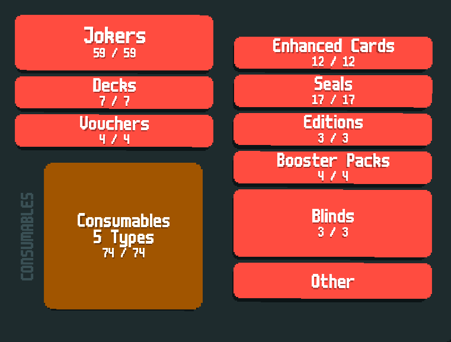

<h1>GIGA</h1>

    
    

<h3>What about adding some random new functionality to Balatro !</h3>

<h2>Requirements</h2>
<ul>
    <li><strong><a href="https://github.com/Steamodded/smods" target="_blank">Steamodded</a></strong>: Version 1.0.0~BETA-1503a or higher is required.</li>
    <li><strong><a href="https://github.com/SpectralPack/Talisman" target="_blank">Talisman</a> (Optional)</strong>: Recommended for high-score management.</li>
</ul>

<h2>Installation</h2>
<ol>
    <li><strong>Download</strong>: 
        <ul>
            <li>For the most <strong>stable version</strong>, download the zip file from the latest <a href="https://github.com/MrYamiTsu/Giga-Balatro_Mod/releases">release</a>.</li>
            <li>For the <strong>latest version</strong> (might be unstable), download the zip from the <a href="https://github.com/MrYamiTsu/Giga-Balatro_Mod/archive/refs/heads/main.zip">Code</a> button.</li>
        </ul>
    </li>
    <li><strong>Extract</strong>: Unzip the downloaded file.</li>
    <li><strong>Place</strong>: Move the extracted folder into your Balatro Mod folder.</li>
</ol>

<h2>Contents</h2>
<table border="1" cellpadding="5" style="border-collapse: collapse;">
    <thead>
        <tr>
            <th>Category</th>
            <th>Count</th>
            <th>Category</th>
            <th>Count</th>
        </tr>
    </thead>
    <tbody>
        <tr>
            <td>Jokers</td>
            <td>61+ (+11 Cross-Mod)</td>
            <td>Food cards</td>
            <td>35 (+6 Cross-Mod)</td>
        </tr>
        <tr>
            <td>Seals</td>
            <td>17</td>
            <td>Planets</td>
            <td>16</td>
        </tr>
        <tr>
            <td>Enhancements</td>
            <td>16</td>
            <td>Artefacts</td>
            <td>13</td>
        </tr>
        <tr>
            <td>Decks</td>
            <td>7</td>
            <td>Spectrals</td>
            <td>7</td>
        </tr>
        <tr>
            <td>Overcharges</td>
            <td>5</td>
            <td>Booster Packs</td>
            <td>4</td>
        </tr>
        <tr>
            <td>Vouchers</td>
            <td>4</td>
            <td>Tarots</td>
            <td>4</td>
        </tr>
        <tr>
            <td>Editions</td>
            <td>3</td>
            <td>Boss Blind</td>
            <td>3</td>
        </tr>
        <tr>
            <td>Sleeves</td>
            <td>3 (Cross-Mod)</td>
            <td>Hand Type</td>
            <td>1</td>
        </tr>
        <tr>
            <td>Deck Skin</td>
            <td>1</td>
            <td>Partner</td>
            <td>1 (Cross-Mod)</td>
        </tr>
    </tbody>
</table>

    <em>*Some Jokers have secret interactions with other Jokers.</em> 
    <em>*Many artworks can be unfinished.</em>

<h2>Cross-Mod</h2>

There’s a lot of crossover with <a href="https://github.com/Joglacraft/Fools-Gambit">Fool's Gambit</a>, so I really recommend checking it out. And the mod itself is absolutely worth playing, it’s genuinely great on its own.

<ul>
    <li><a href="https://github.com/larswijn/CardSleeves">CardSleeves</a></li>
    <li><a href="https://github.com/Icecanno/Partner-API/">Partner-API</a></li>
    <li><a href="https://github.com/Balatro-Paperback/paperback">Paperback</a> (mainly Food cards)</li>
</ul>

<h2>Additional Information</h2>

Giga first appeared in the <strong>Wheel Of Mods</strong> of <strong>MurphyObv</strong> on January 16th, 2026.

If you have any ideas, feel free to ping me in the <strong><a href="https://discord.com/channels/1116389027176787968/1398876204622286958" target="_blank">Giga</a></strong> post on the <strong>Balatro Discord</strong>.

You can also send me artwork; contributors will be mentioned in the credits.

<h2>Credits</h2>
<ul>
    <li><strong>le_dugs</strong>: Ideas and playtesting.</li>
    <li><strong>Jogla</strong>: Spanish translation, fixes, artworks, playtesting, and the Big Collab.</li>
    <li><strong>Frogggy18</strong>: Playtesting and balance changes.</li>
    <li><strong>Zeed</strong>: Playtesting, English corrections, and ideas.</li>
    <li><strong>Eris</strong>: Code fixing.</li>
    <li>*All the dev in the Balatro modding community*.</li>
</ul>