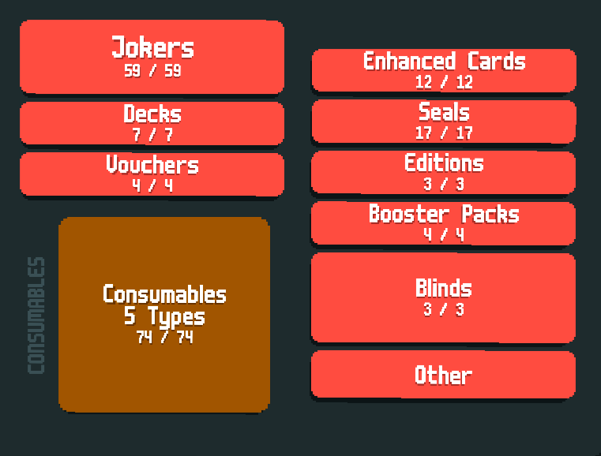

# GIGA Mod for Balatro

> What about adding some random new functionality to Balatro!

---

## Requirements

- **[Steamodded](https://github.com/Steamodded/smods)**: Version `1.0.0~BETA-1503a` or higher is required.
- **[Talisman](https://github.com/SpectralPack/Talisman) (Optional)**: Recommended for high-score management.

---

## Installation

1. **Download**:
   - **Stable Version**: Download the zip file from the latest [Releases](https://github.com/MrYamiTsu/Giga-Balatro_Mod/releases).
   - **Latest Version (Unstable)**: Download the zip via the [Code](https://github.com/MrYamiTsu/Giga-Balatro_Mod/archive/refs/heads/main.zip) button.
2. **Extract**: Unzip the downloaded archive.
3. **Place**: Move the extracted folder into your Balatro Mods folder (`%AppData%/Roaming/Balatro/Mods`).

---

## Content

| Category         | Count               | Category          | Count             |
| :--------------- | :------------------ | :---------------- | :---------------- |
| **Jokers**       | 64+ (+11 Cross-Mod) | **Food cards**    | 35 (+6 Cross-Mod) |
| **Seals**        | 20                  | **Planets**       | 16                |
| **Enhancements** | 16                  | **Artefacts**     | 13                |
| **Spectrals**    | 8                   | **Decks**         | 7                 |
| **Overcharges**  | 5                   | **Booster Packs** | 4                 |
| **Vouchers**     | 4                   | **Tarots**        | 4                 |
| **Boss Blind**   | 4                   | **Editions**      | 3                 |
| **Sleeves**      | 3 (Cross-Mod)       | **Hand Type**     | 1                 |
| **Deck Skin**    | 1                   | **Partner**       | 1 (Cross-Mod)     |

> - **Note:** Some Jokers have secret interactions with other Jokers.
> - **Note:** Many artworks are still unfinished.

---

## Cross-Mod Compatibility

There is a lot of crossover with **[Fool's Gambit](https://github.com/Joglacraft/Fools-Gambit)**, so checking it out is highly recommended. The mod itself is genuinely great on its own.

- **[CardSleeves](https://github.com/larswijn/CardSleeves)**
- **[Partner-API](https://github.com/Icecanno/Partner-API/)**
- **[Paperback](https://github.com/Balatro-Paperback/paperback)** _(mainly Food cards)_

---

## Additional Information

- **Giga** first appeared in the **Wheel Of Mods** by **MurphyObv** on January 16th, 2026, and was played on August 26th, 2026.
- Have ideas? Feel free to ping me in the **[Giga Discord Thread](https://discord.com/channels/1116389027176787968/1398876204622286958)**.
- Artwork submissions are welcome; contributors will be credited.

---

## Credits

- **le_dugs**: Ideas and playtesting.
- **Jogla**: Spanish translation, fixes, artworks, playtesting, and the Big Collab.
- **Frogggy18**: Playtesting and balance changes.
- **Darling**: Playtesting, English corrections, and ideas.
- **Yotam**: Artwork and ideas.
- **Eris**: Code fixing.
- _Special thanks to all developers in the Balatro modding community._

---

  <i>This README covers the current development version. For stable versions and changelogs, please visit the <a href="https://github.com/MrYamiTsu/Giga-Balatro_Mod/releases">Latest Releases</a>.</i>

