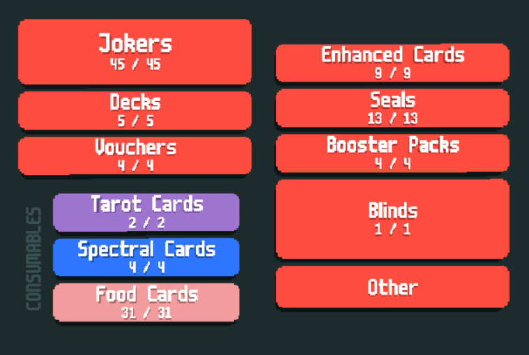

<h1>GIGA</h1>

Some random additions for <strong>Balatro</strong>. Some assets work weirdly sometimes.

<h2>Installation</h2>

    <a href="https://github.com/Steamodded/smods">Steamodded </a>1.0.0~BETA-0711a or higher is required. 
    Can be useful to have <a href="https://github.com/SpectralPack/Talisman">Talisman</a> too.

Just download the zip file, extract it and place it in your Mod folder.

<h2>Cross-Mod</h2>

There are some extra assets if you have other mods. Here is a list:

<ul>
    <li><a href="https://github.com/SpectralPack/Cryptid">Cryptid</a></li>
</ul>

<h2>Elements</h2>
<ul>
    <li>28+ Jokers</li>
    <li>23 Foods (+1 CrossMod)</li>
    <li>4 Booster Packs</li>
    <li>5+ Enhancements</li>
    <li>2 Vouchers</li>
</ul>

<em>*Some Jokers have secret interactions with other Jokers.</em> 
<em>*Many artworks are either unfinished or missing.</em>

<h2>Additional Infos</h2>

    If a whole asset is in comment, don't remove it from the comment. It's an idea and this may cause the game to crash. 
    If you have any ideas for how the mod's elements might interact, feel free to DM me on Discord (<strong>@MrYamiTsu</strong>).
    You can also send me artwork of the elements if you like (I'll mention you in the credits).

<h2>Credits</h2>
<ul>
    <li><strong>le_dugs</strong> for a lot of ideas</li>
    <li><strong>frogggy18</strong> for some balance changes</li>
</ul>